# The Legend of Shiitakoin Early Access

## Writeup by wez

###### Introduction and Setting things up

For this challenge, you are given :

- An .n64 rom - that can be played on an Nintendo 64 emulator
- An .out file - that I will talk about later
- A link to a dev version of Project 64.

First, I setup my controller inputs in the emulator, and I also enabled the debugger in the advanced settings of the emulator.

### Flag 1/2

Then, by pressing Start when launching the rom, I was greeted with this screen:

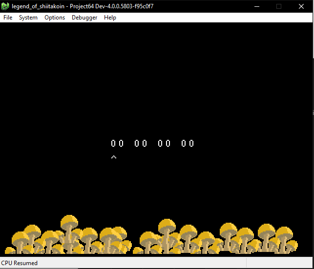

We can use the D-Pad up and down to increment/decrement values, and press Z to go to the next hexadecimal byte.

Then, by pressing R, we confirm the code and renders the message "INCORRECT". Given this info, we already know that we probably have to enter the correct 4 bytes to print a flag.

#### What about that .out file? What does it do?

So the first thing I did with this .out file

I quickly found a function named `evaluationRoutine` that checks if the four inputs are correct. Ghidra decompiled it like this:

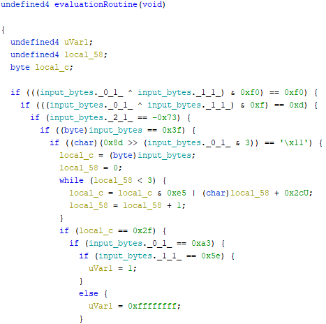

By looking at this, we can safely assume that our goal is to pass all the conditions, enter all the ifs and reach `uVar1 = 1`.
This is even confirmed by another function found in Ghidra named `interactiveScreenShow`.

#### interactiveScreenShow, or Where The Flag Gets Rendered(tm)

We see that `evalationRoutine` gets called, and if the return value is different than 1, we render INCORRECT.

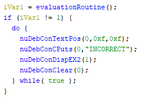

In the same file, we can see how the flag is being rendered. We learn here that it uses the 4 input bytes to take parts of a long string and build the flag.

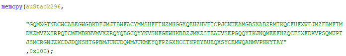

`auStack296` corresponds to the long string in question,

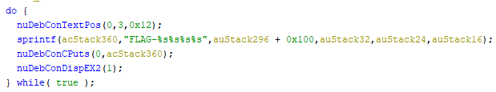

and the other stacks that define the flag are values that depends on the 4 byte inputs.

#### Back to evaluationRoutine, how do we pass all the conditions?

Let's go back to `evaluationRoutine` and try to figure out what to do.
I wanted to make sure what each `input_bytes` corresponds to.
I clicked on the first if statement in Ghidra and it brought me to this XOR in memory.

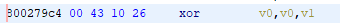

I simply used the Commands tool from the PJ64 Debugger, and went to the address `800279c4`. Luckily, it matched the address from Ghidra, so it will be easy to find where in memory our addresses are.

I manually entered random unique numbers for each bytes in the rom, added a breakpoint on this address, and after pressing R to submit the "password", it indeed hit the breakpoint and we could see that `input_bytes._0_1_` and `input_bytes._1_1_` corresponded to our `v0` and `v1` registers.

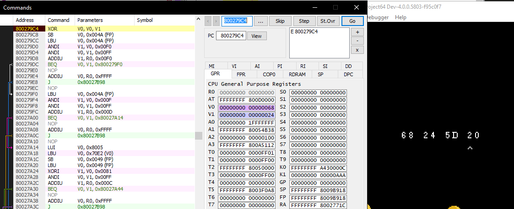

(Here we can see in the list - in purple and blue - that `v0` and `v1` are being used by this XOR operation)

By hitting some other breakpoints I could establish that the order of the four bytes are :
`input_bytes._0_1_`
`input_bytes._1_1_`
`input_bytes._2_1_`
`input_bytes`

#### SOLVING TIME!

We can REALLY easily find what the 4 byte inputs are.

At first, I approached a trial & error method. I would check every if condition one by one, try numbers that would work and see if it hit further in the code using breakpoints. This was good for confirming the order of the 4 bytes, but I realized something after a bit.

All we need are those 4 lines:

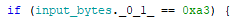

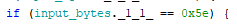

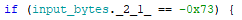

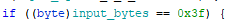

Because they are the deepest and most strict conditions for each bytes we have, so only making those pass is enough for us.

For `-0x73`, because it is negative we simply negate it and get:

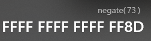

We just keep the `8D`.

This means that we have:
`input_bytes._0_1_ = A3`
`input_bytes._1_1_ = 5E`
`input_bytes._2_1_ = 8D`
`input_bytes = 3F`

We can enter those values, press R and...

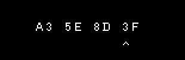

Voilà!

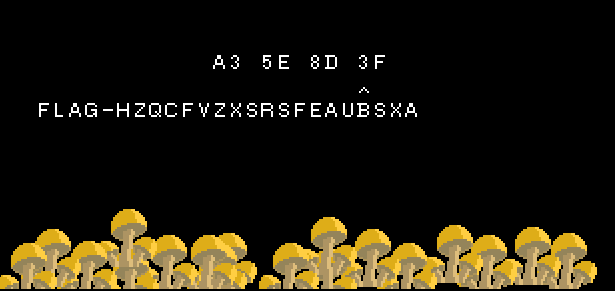

This flag was worth 4 points, and solving it gave us the information that there was another flag to find...

---

### Flag 2/2

Time to get the second flag!

When we restart the game, pressing start two times brings us to stage 2. Here, we can make our own little mushroom NFT :D
We can use the D-Pad to move our mushroom and press R to confirm the location.

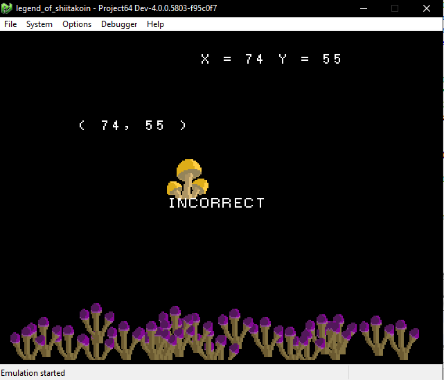

The game is also kind enough to show us the X and Y coordinates of where we place it. We could try to find where this data is used using only Ghidra, but let's have some fun and try to find the right address using tools from the Project 64 Emulator.

#### Memory Searching

For this part, we can use the Search Memory tool. It's under Debugger -> Memory -> Search...

Our goal here is to identify the address of the X and Y coordinates in the rom's memory. The Search Memory tool helps us finding these addresses by saving all the addresses that contains a specific value we're looking for. We can then isolate those addresses further by changing those values and scanning for them again.

Let's say we want to search for our X coordinate in memory, we can pick a number, use it as our coordinate and search for it.

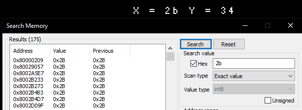

It returns us 175 addresses which contain this value. This is a lot, so to narrow it down we can move the mushroom to get another value for X. Let's say we go to `X = 95`, and we can then search again for that new value.

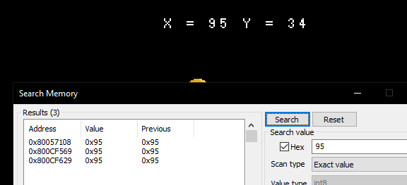

That should be it, for testing we can move the mushroom again and check if the value is updated in the Search Memory tool:

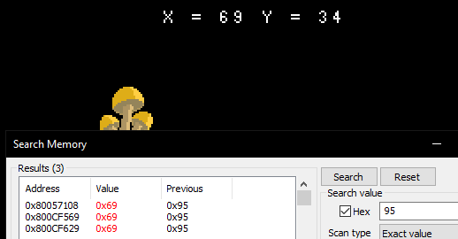

And indeed, we can see that the value gets overwritten in real time.
We have the address `0x80057108` that we will try to go to in Ghidra.

#### Back to Ghidra to find the functions we need!

If we press G to go to the address we saved, we will see that it's called `triPos_x` in the .out file and that it is referenced in functions named `initStage02`, `makeDL02` and `updateGame02`.

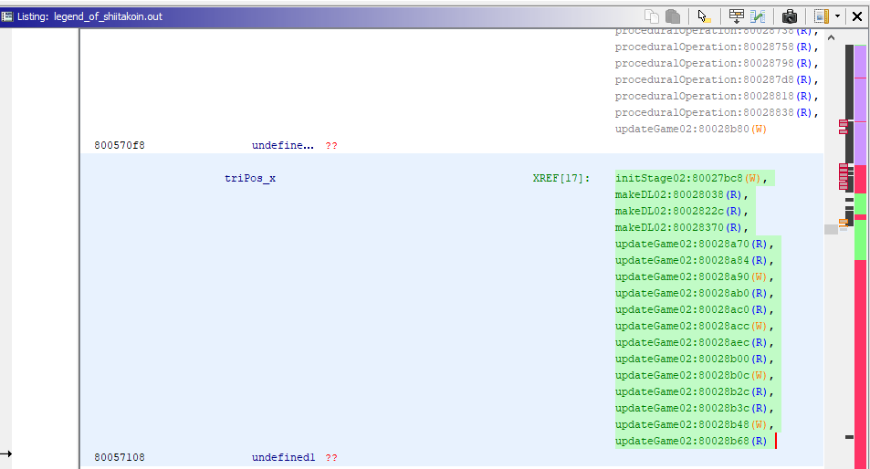

`initStage02` is a function used for variable initialization.

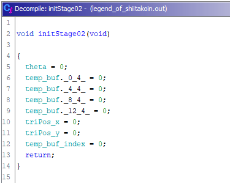

`makeDL02` is used mostly to draw stuff on screen like the sprites and the coordinates at the top

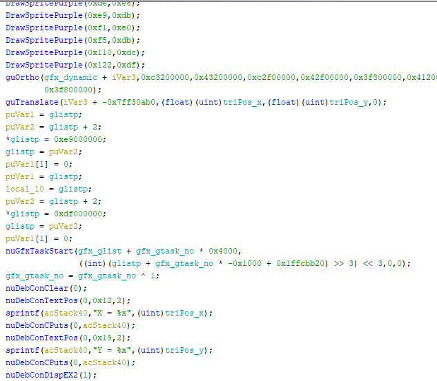

And `updateGame02` looks a lot more interesting to us:

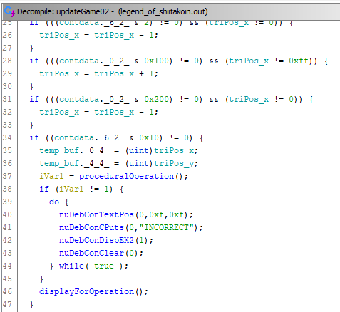

First we can see that it sets the values of our X and Y coordinates in this `temp_buf`, which will be used later.

We can then safely assume that:

- `proceduralOperation()` is the function we have to reverse engineer to know which values in `temp_buf` are correct.
- `displayForOperation()` is the function that generates our flag based on the X and Y coordinates that will be in `temp_buf`.

#### Reversing the check function

So here again we could be reversing MIPS, but I decided to cheat again and just check the decompiled Ghidra code:)

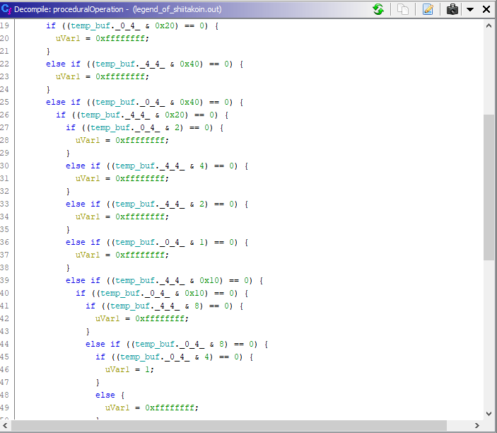

Ahh, so easy to read! :D

Here, `temp_buf._0_4_` corresponds to X and `temp_buf._4_4_` corresponds to Y.
Our goal here now is to avoid entering a `if` that will make `uVar1 = 0xffffffff;` and make sure it goes in `uVar1 = 1;`.
To do this, I listed out all the conditions and if they needed to fail or pass.

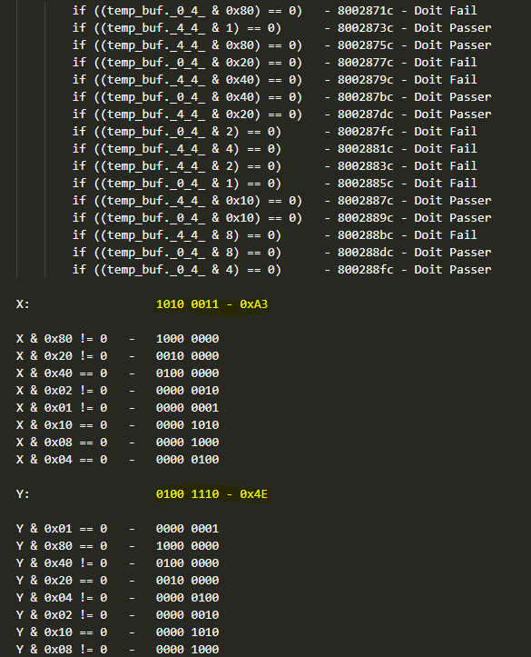

I listed every AND instruction with its corresponding address in memory in case I needed to use breakpoints to verify my progress.

We can use all the AND operations that don't equal 0 on the specified bits, and our number will be correct.
So for X, we have to make sure our AND is true for
`1000 0000`
`0010 0000`
`0000 0010` and
`0000 0001`.
This gives `1010 0011` as our final value, which equals `0xA3`.

We can do the same thing with Y to find `0x4E`.

Time to try it...

And here it is, our beautiful second flag, for another 4 points! :mushroom:

---

## Conclusion

I enjoyed this track a lot! I loved learning to use those Project 64 tools. I was really impressed by how sturdy, useful and quick they were. I loved that I could use save states, manipulate the memory and play around in the game, and load back to previous states without anything crashing or freezing.

I think it would be interresting to solve this challenge in fun other ways using only the tools available in Project 64. Maybe we could use the Scripts engine and do some wacky stuff like a brute forcer? Or even try to become better at MIPS assembly by doing it only with the Commands tool and Debugger?

Overall, I think this was a really fun challenge and hope for more stuff like this in the future!

Oh, and as a bonus, here's a little screenshot of stage 3, that seems unfinished. Try to access it if you can!

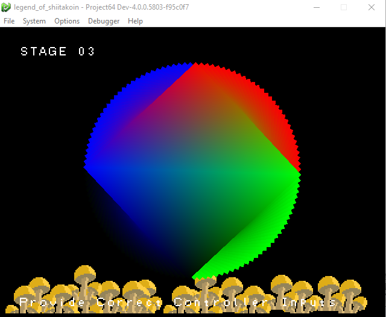
